# ES606_Project_EEG_Encoding

Applying the linearizing encoding model and end-to-end AlexNet by Gifford et al. on the THINGS EEG1 dataset by Grootswagers et al. Below we summarize the methodology and results. See the project report PDF for more details on motivation, background and the dataset.

### Dataset reference: https://osf.io/hd6zk/

Grootswagers, T., Zhou, I., Robinson, A.K. et al. Human EEG recordings for 1,854 concepts presented in rapid serial visual presentation streams. Sci Data 9, 3 (2022). https://doi.org/10.1038/s41597-021-01102-7

### Code reference: https://github.com/gifale95/eeg_encoding/

Gifford AT, Dwivedi K, Roig G, Cichy RM. 2022. A large and rich EEG dataset for modeling human visual object recognition. NeuroImage, 264:119754. DOI: https://doi.org/10.1016/j.neuroimage.2022.119754

The code has been modified extensively for this dataset, and assumes the directory structure given in `tree.txt`.

## 0. Prepare the dataset

The first step is to transform the given preprocessed EEGLAB format data into numpy arrays. Then visualize the ERPs and reject the participants whose ERPs show large spikes and artifacts. See `plots/erps/reject` for the rejected participants.

## 1. Extract DNN feature maps 

We use AlexNet, pretrained on the ImageNet dataset to extract feature maps from the images in the THINGS image dataset. Since this is a very high-dimensional vector, we perform dimensionality reduction using kernel PCA with a polynomial kernel of degree 4 and retain the 1000 most important components of the feature vectors.

## 2. Training

As a first step, we train a linearizing encoding model, essentially a linear regression between the principal components of the feature vector and the EEG data for each channel and time-point. We also train randomly initalized AlexNets in an end-to-end fashion to synthesize the EEG visual response when fed in the corresponding image.

## 3. Correlation analysis

As a measure of how well our models synthesize the EEG data, we perform a correlation analysis using Pearson's-$r$. We observe significant correlation  above chance level for both within and between subjects model training. Curiously, the end-to-end encoding model shows a poorer correlation compared to the linearizing encoding model. We skip the noise ceiling analysis due to much fewer test repetitions.

### Average correlation for linearizing encoding model (within subjects)

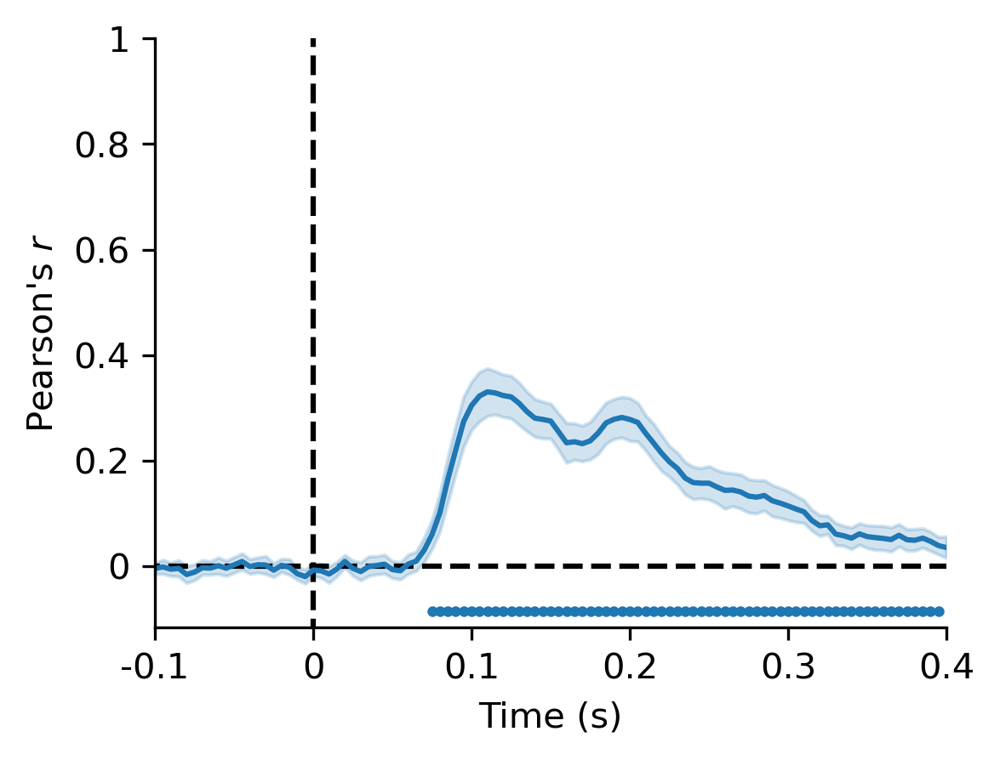

### Average correlation for linearizing encoding model (between subjects)

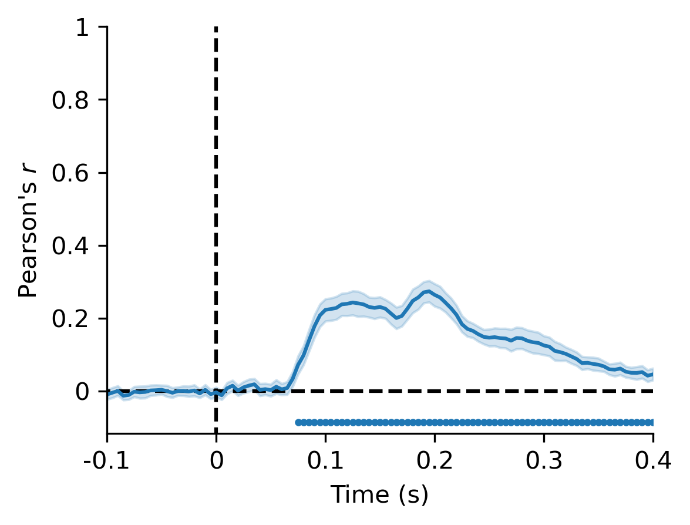

### Average correlation for end-to-end AlexNet encoding model (within subjects)

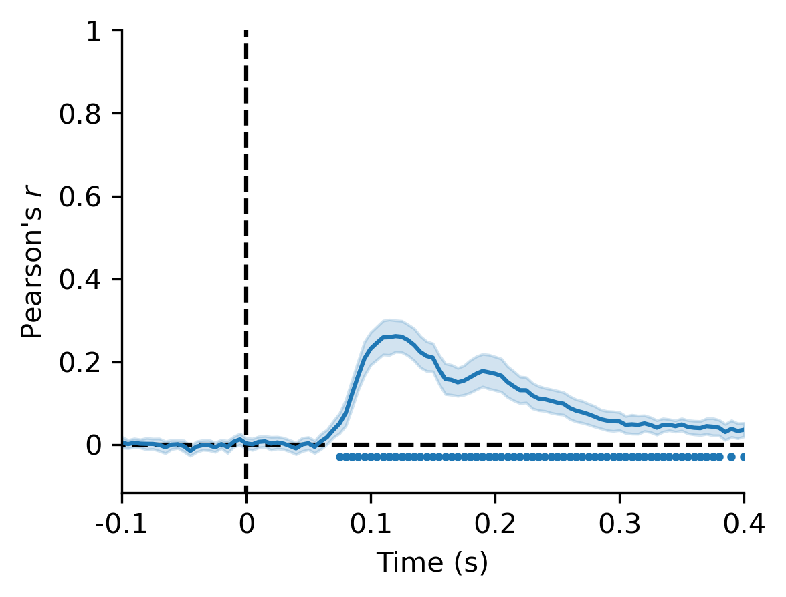

### Comparison between the different approaches, averaged over subjects

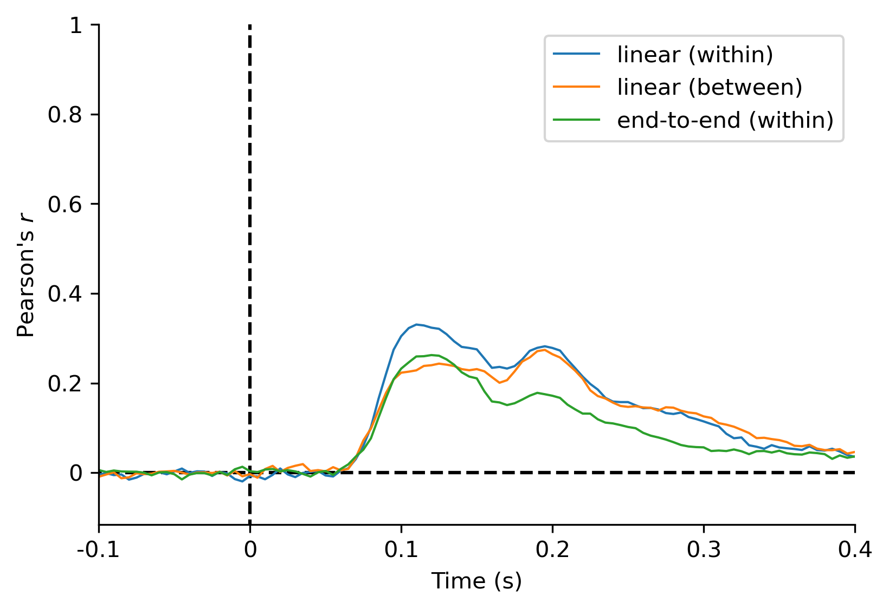

### Single participant correlation for linearizing encoding model (within subjects)

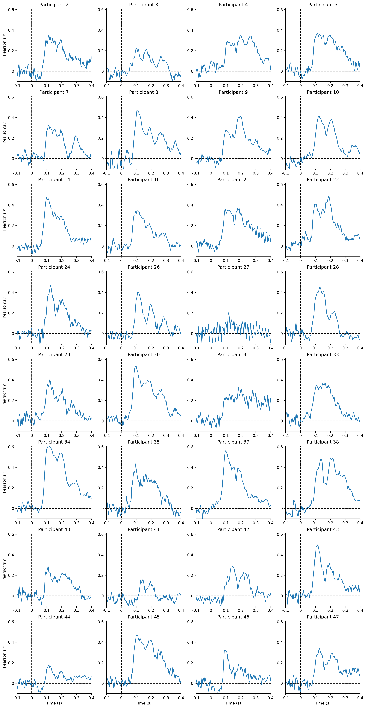

### Single participant correlation for linearizing encoding model (between subjects)

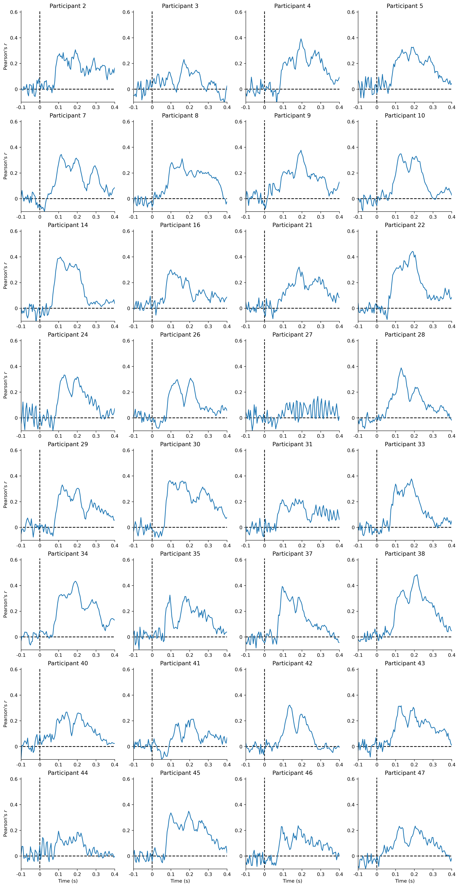

### Single participant correlation for end-to-end AlexNet encoding model (within subjects)

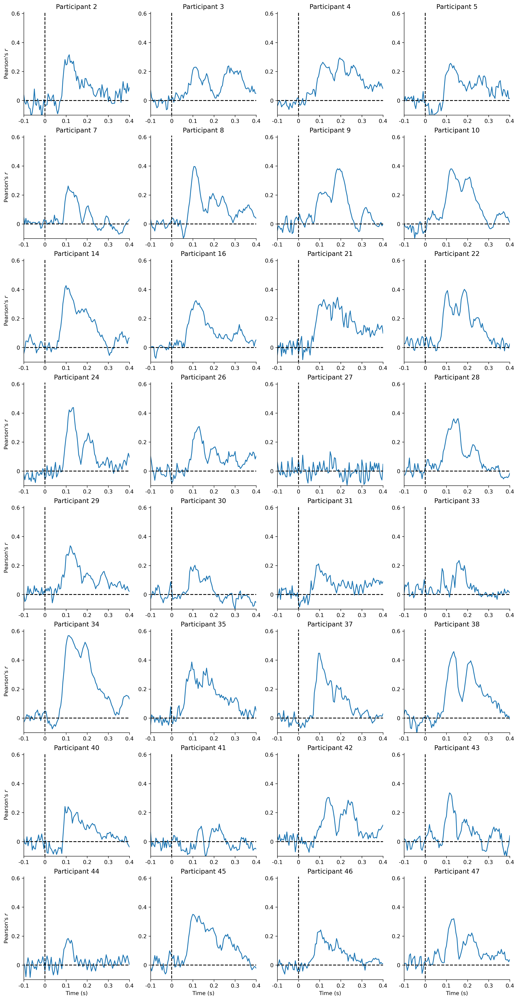

### Comparison between the different approaches for single participants

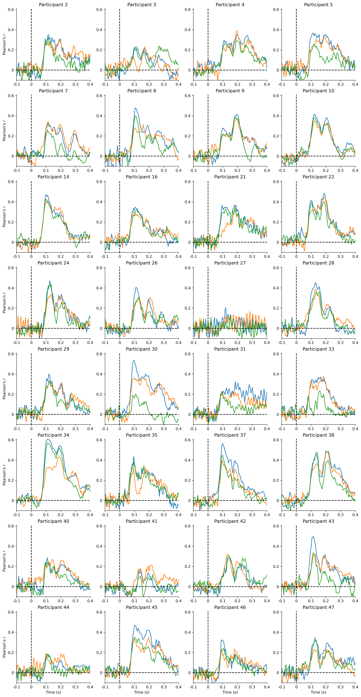

### Single channel correlation for linearizing encoding model (within subjects)

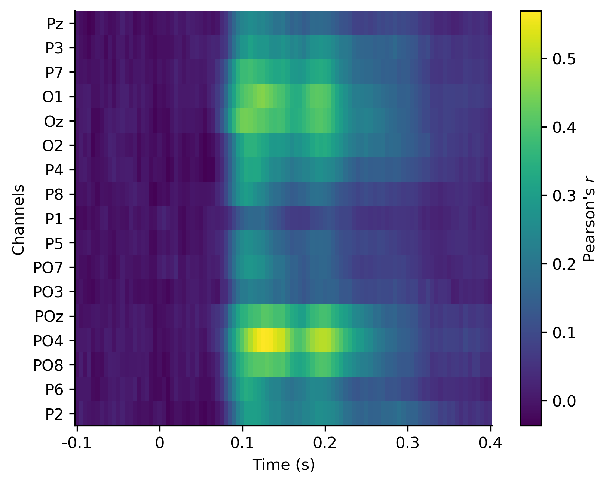

### Single channel correlation for linearizing encoding model (between subjects)

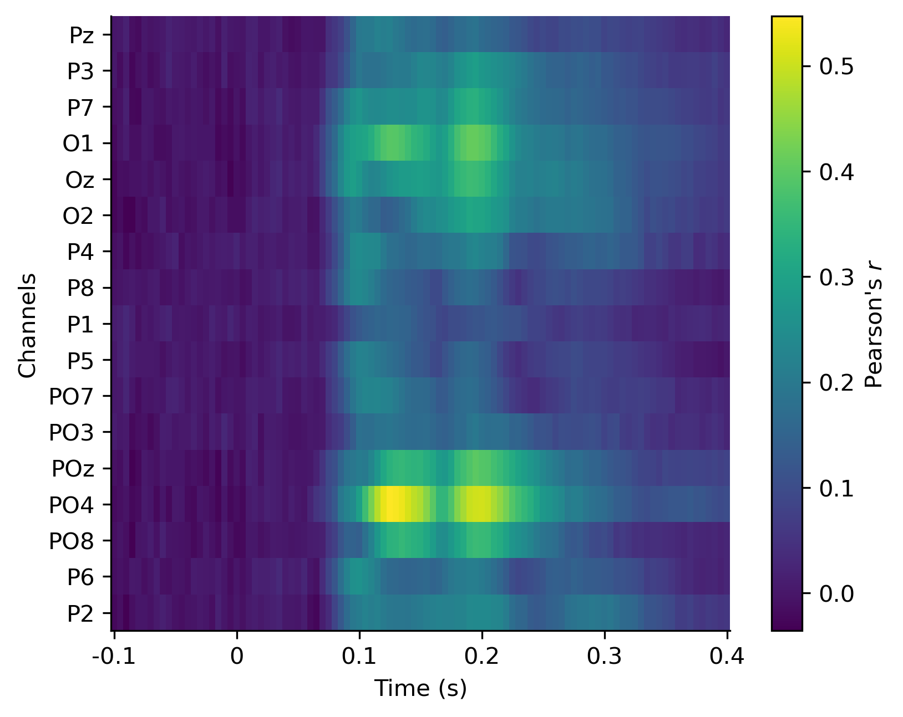

### Single channel correlation for end-to-end AlexNet encoding model (within subjects)

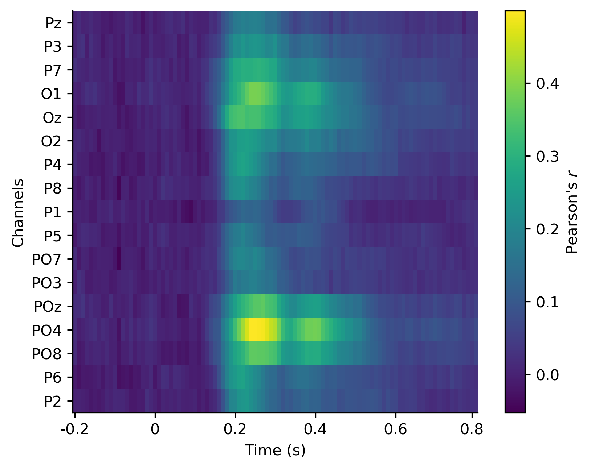
